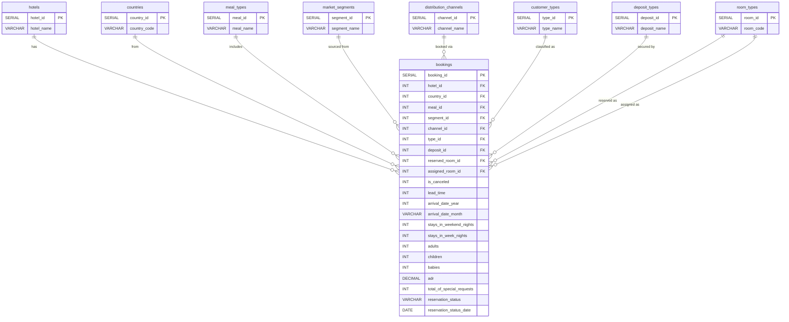

# Hotel Booking Demand Analysis

## Executive Summary

A comprehensive business intelligence project analyzing over 119,000 hotel booking records across two property types   City Hotel and Resort Hotel   spanning the period from 2015 through 2017. The project demonstrates end-to-end data engineering and analytics capabilities, from normalized database design and ETL processing in PostgreSQL to interactive dashboard development in Power BI.

The core objective is to surface actionable insights on booking performance, cancellation behavior, pricing seasonality, guest demographics, and revenue impact   metrics that directly inform strategic decisions in the hospitality and online travel industry.

---

## Table of Contents

- [Business Context](#business-context)
- [Data Architecture](#data-architecture)
- [Dataset Overview](#dataset-overview)
- [Technical Stack](#technical-stack)
- [Project Structure](#project-structure)
- [Database Design](#database-design)
- [SQL Analysis](#sql-analysis)
- [Power BI Dashboard](#power-bi-dashboard)
- [Key Findings](#key-findings)
- [How to Reproduce](#how-to-reproduce)
- [Data Source](#data-source)
- [License](#license)

---

## Business Context

In the online travel agency (OTA) landscape, understanding booking patterns, cancellation drivers, and pricing dynamics is fundamental to revenue optimization. This analysis addresses the following business questions:

**Booking Performance and Revenue**
- What is the overall booking volume and how does it trend across months?
- What is the Average Daily Rate (ADR) and how does it vary by hotel type and season?
- How much potential revenue is lost due to cancellations?

**Cancellation Behavior**
- What is the overall cancellation rate and how does it differ between City and Resort hotels?
- How does lead time influence the likelihood of cancellation?
- Which market segments and deposit types exhibit the highest cancellation risk?
- What is the cancellation profile across customer types?

**Guest Demographics and Retention**
- Which countries generate the most bookings?
- What is the repeat guest rate and how do repeat guests differ in behavior?
- How can guests be segmented by spending patterns?

**Operational Intelligence**
- Which distribution channels deliver the highest confirmed revenue?
- What is the relationship between room type assignment (reserved vs. assigned) and ADR?
- How does length of stay correlate with cancellation probability?

---

## Data Architecture

The database follows a Star Schema design pattern with one central Fact table (`bookings`) surrounded by eight Dimension tables. This structure is optimized for analytical query performance and aligns with industry-standard data warehouse modeling practices.

> See [er-diagram.mermaid](./er-diagram.mermaid) for the source file.



### Schema Summary

| Layer | Table | Role | Records |
|---|---|---|---|
| Fact | bookings | Central transaction table | 119,390 |
| Dimension | hotels | Property type classification | 2 |
| Dimension | countries | Guest origin country | 178 |
| Dimension | meal_types | Meal plan category | 5 |
| Dimension | market_segments | Booking source segment | 8 |
| Dimension | distribution_channels | Booking distribution path | 5 |
| Dimension | customer_types | Guest classification | 4 |
| Dimension | deposit_types | Payment security type | 3 |
| Dimension | room_types | Room category code | 12 |

### Relationship Summary

| From | To | Join Key | Cardinality |
|---|---|---|---|
| hotels | bookings | hotel_id | One-to-Many |
| countries | bookings | country_id | One-to-Many |
| meal_types | bookings | meal_id | One-to-Many |
| market_segments | bookings | segment_id | One-to-Many |
| distribution_channels | bookings | channel_id | One-to-Many |
| customer_types | bookings | type_id | One-to-Many |
| deposit_types | bookings | deposit_id | One-to-Many |
| room_types | bookings | reserved_room_id | One-to-Many |
| room_types | bookings | assigned_room_id | One-to-Many |

---

## Dataset Overview

This data set contains booking information for a City Hotel and a Resort Hotel, including details on when the booking was made, length of stay, the number of adults, children, and babies, the number of available parking spaces, and other operational attributes. All personally identifying information has been removed.

The data is originally from the article "Hotel Booking Demand Datasets" written by Nuno Antonio, Ana Almeida, and Luis Nunes for Data in Brief, Volume 22, February 2019. It was subsequently cleaned by Thomas Mock and Antoine Bichat for the TidyTuesday initiative.

**Source:** [Kaggle - Hotel Booking Demand](https://www.kaggle.com/datasets/jessemostipak/hotel-booking-demand/data)

---

## Technical Stack

| Component | Technology |
|---|---|
| Database | PostgreSQL 18 |
| Database Administration | pgAdmin 4 |
| Query Language | SQL (PostgreSQL dialect) |
| ETL Process | SQL-based staging and transformation |
| Data Visualization | Microsoft Power BI Desktop |
| Version Control | Git / GitHub |

---

## Project Structure

```
hotel-booking-demand-analysis/
|
|-- README.md
|-- er-diagram.mermaid
|
|-- sql/
|   |-- Hotel Booking Database.sql
|
|-- powerbi/
|   |-- hotel_bookings.pbix
|   |-- Hotel Booking Performance Analytics.png
|
|-- Datasets/
|   |-- hotel_bookings.csv
```

---

## Database Design

The raw CSV was not loaded directly into the analytical model. Instead, a staged ETL approach was implemented:

1. **Staging Layer:** The raw CSV file (119,390 rows, 31 columns) was imported into a temporary `bookings_raw` staging table with no constraints, preserving the original flat structure.

2. **Dimension Population:** Dimension tables were pre-populated with known categorical values (hotel types, meal plans, market segments, distribution channels, customer types, deposit types, room codes). Country codes were dynamically extracted from the staging table using `SELECT DISTINCT` and inserted into the `countries` dimension.

3. **Fact Table Transformation:** A single `INSERT INTO ... SELECT` statement with nine `LEFT JOIN` operations transformed the denormalized staging data into the normalized Star Schema, mapping text values to their corresponding surrogate keys in each dimension table.

4. **Validation and Cleanup:** Row counts were reconciled between the staging and fact tables to confirm data integrity. The staging table was dropped after successful validation.

This approach ensures referential integrity, reduces storage through normalization, and delivers optimal query performance through indexed foreign key relationships.

---

## SQL Analysis

The SQL component of this project demonstrates proficiency across the following areas:

### Data Definition and Engineering
- Star Schema design with 1 Fact table and 8 Dimension tables
- Foreign key constraints ensuring referential integrity
- Index creation on high-cardinality filter columns for query optimization
- Staged ETL pipeline using temporary tables and multi-table JOIN transformation

### Analytical Query Capabilities

**Booking Overview**
- Total booking volume segmented by hotel type with cancellation rates
- Monthly booking trend analysis with year-over-year comparison

**Cancellation Deep Dive**
- Cancellation rate decomposition by lead time buckets using CASE expressions
- Cross-tabulation of cancellation rates across deposit types, customer types, and market segments
- Average lead time analysis per segment to identify high-risk booking profiles

**Revenue and Pricing Analytics**
- Average Daily Rate (ADR) seasonality analysis by hotel type and calendar month
- Revenue impact quantification: confirmed revenue vs. revenue lost to cancellations
- Room type assignment analysis comparing reserved vs. assigned room codes and their ADR implications

**Guest Behavior and Retention**
- Repeat guest profiling with comparative metrics (cancellation rate, ADR, lead time, special requests)
- Top countries by booking volume with associated cancellation rates and average stay duration
- Length of stay segmentation with cancellation probability correlation

**Advanced SQL Techniques**
- Common Table Expressions (CTEs) for multi-step analytical pipelines
- Window Functions: LAG for month-over-month growth calculation, RANK for risk scoring, running totals via SUM OVER
- PERCENTILE_CONT for median calculation in distribution analysis
- Conditional aggregation using CASE WHEN within aggregate functions
- NULLIF for safe division and COALESCE for null handling

---

## Power BI Dashboard

The interactive dashboard consolidates the analytical findings into a single-page executive view, designed for both strategic and operational stakeholders.


### Dashboard Components

**KPI Cards (5 metrics)**

| Metric | Value | Description |
|---|---|---|
| Total Bookings | 239K | Total booking records across both hotel types |
| Cancellation Rate | 37% | Proportion of bookings that were canceled |
| Average Daily Rate | R$101.83 | Mean revenue per occupied room per night |
| Repeat Guest Rate | 3% | Percentage of returning guests |
| Avg Lead Weeks | 14.86 | Average weeks between booking and arrival |

**Analytical Visuals**

| Visual | Type | Purpose |
|---|---|---|
| Monthly Bookings and Cancel Rate Trend | Line and Clustered Column (Dual Axis) | Identifies seasonal booking patterns and cancellation rate fluctuations across the calendar year |
| Cancellation Rate by Lead Time Bucket | Clustered Bar Chart | Quantifies the relationship between booking lead time and cancellation probability |
| ADR by Month (City vs Resort) | Area Chart | Reveals pricing seasonality differences between property types |
| Market Segment Share | Donut Chart | Visualizes the contribution of each booking source to total volume |
| Revenue Confirmed vs Lost | Clustered Bar Chart | Compares realized revenue against potential revenue lost to cancellations by hotel type |

**Interactive Filters**

| Slicer | Options |
|---|---|
| All Hotels | City Hotel / Resort Hotel / All |
| All Years | 2015 / 2016 / 2017 / All |

### DAX Measures

The dashboard is powered by custom DAX measures including Total Bookings, Cancellation Rate, ADR, Repeat Guest Rate, Avg Lead Weeks, Confirmed Revenue, Revenue Lost, and Cancel Rate %. A calculated column (Lead Time Bucket) segments bookings into actionable lead time ranges for risk analysis.

---

## Key Findings

| Metric | Value |
|---|---|
| Total Bookings | 239,390 |
| Overall Cancellation Rate | 37% |
| Average Daily Rate | R$ 101.83 |
| Repeat Guest Rate | 3% |
| Average Lead Time | 14.86 weeks |
| Online TA Market Share | 47.3% |
| Cancellation Rate (180+ day lead time) | ~62% |
| Cancellation Rate (0-7 day lead time) | ~15% |

**Strategic Insights:**

Lead time is the strongest predictor of cancellation in this dataset. Bookings made more than 180 days in advance exhibit cancellation rates exceeding 60%, compared to approximately 15% for bookings within one week of arrival. This finding has direct implications for overbooking strategy, deposit policy design, and dynamic pricing models.

The repeat guest rate of 3% indicates a significant retention gap. Combined with the dominance of Online TA channels at 47% of all bookings, these metrics suggest heavy reliance on third-party acquisition with limited direct relationship building. A targeted loyalty program could meaningfully reduce customer acquisition costs.

Resort Hotel ADR demonstrates pronounced seasonality with summer peaks, while City Hotel pricing remains comparatively stable across the year. This differential informs distinct revenue management strategies for each property type.

---

## How to Reproduce

### Prerequisites

- PostgreSQL 14 or higher
- pgAdmin 4 or any PostgreSQL client
- Microsoft Power BI Desktop
- Dataset downloaded from [Kaggle](https://www.kaggle.com/datasets/jessemostipak/hotel-booking-demand/data)

### Steps

1. Clone this repository.

```bash
git clone https://github.com/your-username/hotel-booking-demand-analysis.git
cd hotel-booking-demand-analysis
```

2. Create the database and execute the schema script.

```bash
psql -U postgres -f "sql/Hotel Booking Database.sql"
```

3. Import the CSV into the staging table.

```sql
COPY bookings_raw
FROM '/path/to/hotel_bookings.csv'
WITH (FORMAT csv, HEADER true, DELIMITER ',');
```

4. Run the transformation queries to populate the Fact and Dimension tables.

5. Open `hotel_bookings.pbix` in Power BI Desktop and update the PostgreSQL connection to your local instance.

---

## Data Source

Antonio, N., de Almeida, A., and Nunes, L. (2019). "Hotel Booking Demand Datasets." Data in Brief, Volume 22, pp. 41-49.

Data cleaned by Thomas Mock and Antoine Bichat for TidyTuesday (February 11, 2020).

Available at: [Kaggle - Hotel Booking Demand](https://www.kaggle.com/datasets/jessemostipak/hotel-booking-demand/data)

---

## License

This project is intended for educational and portfolio purposes only. The dataset is subject to the original license terms as published on Kaggle.